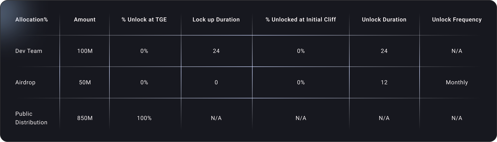

# $SP Distribution Model & Tokenomics

A strong, sustainable token economy ensures that $SP retains its long-term value and encourages users to hold, use, and support the Silent Pass ecosystem.

🔹 Token Supply & Allocation

✔ Total Supply: 1 Billion $SP (Fixed, No Inflation)

✔ Public Distribution: 85% (Available to users and ecosystem participants)

✔ Dev Team: 10% (Locked for 24 months, ensuring long-term commitment)

✔ Airdrop & Incentives: 5% (Vested over 12 months for community rewards)

\
Silent Pass prioritizes fair distribution, ensuring that most of the tokens remain in circulation for user participation.\

<figure><figcaption></figcaption></figure>

***

### Deflationary Burn Mechanism: Reducing Supply Over Time

Unlike inflationary tokens that continuously print more supply, $SP incorporates a burn mechanism to make the token increasingly scarce over time.

#### 🔹 How the Burn Mechanism Works:

✔ Every Silent Pass subscription purchase burns 10% of the $SP spent.

✔ An additional 10% is allocated to the Silent Pass Grant Program, funding privacy-focused initiatives and supporting journalists, activists, and censorship-resistance projects.

✔ As more users adopt Silent Pass, fewer $SP tokens remain in circulation, increasing long-term value.

\
This mechanism ensures that $SP becomes more valuable as the network grows, while also funding privacy advocacy and Web3 decentralization efforts.

***

#### 🔹 Why the Burn Mechanism Matters

✔ Creates long-term scarcity—fewer tokens remain in circulation over time.

✔ Encourages adoption—more users = more burns, increasing $SP’s value.

✔ Funds real-world privacy initiatives—Silent Pass gives back to the Web3 privacy community.

\
Unlike traditional VPNs, which charge fees without reinvesting in user benefits, Silent Pass ensures that every purchase strengthens the ecosystem and reduces token supply.
